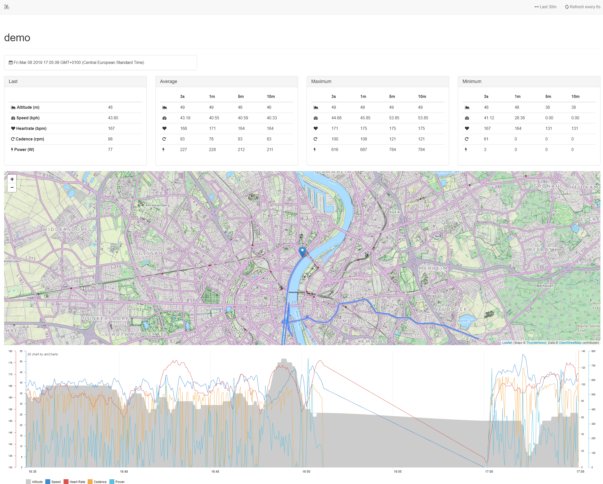

# Live Tracking

With this open source live tracking software you can record and analyze data in real time.
You have full control over the data, because the software runs on your own server.
You are able to track your time elapsed, distance, speed and elevation in real time.
And if you have any ANT+ or Bluetooth sensors, this data can also be transmitted.
Optimized for easy use.

## Input

With the Android app [IpBike](http://www.iforpowell.com/) you can transfer your data in real time.
Deposit your access data in `Settings` > `Upload settings` > `Custom livetracking settings`.
The app supports ANT+ and Bluetooth sensors.
You can transfer your speed, heart rate, cadence and power as well as the GPS coordinates.

## Output

This software is very much based on [InfluxDB](https://www.influxdata.com/).
So you have all the advantages of a very fast time series database.
It aims to answer queries in real-time.
Each user comes with his own InfluxDB database for live tracking.
Only you as an owner can write to the database.
You can give other users read rights to your live tracking database.
Currently you can save 8 hours of data.

If you make your profile public, anyone can view your data at the following URL:
`https://your-domain.local/public/YOUR-USERNAME`

If your profile is not public, your friends can view your data at the following URL:
`https://your-domain.local/watch/YOUR-USERNAME`

Because you have your own InfluxDB database, you can also use other evaluation programs.
A popular program is e.g. [Grafana](http://docs.grafana.org/features/datasources/influxdb/).
Use the URL <code>https://your-domain.local</code> and the database name <code>YOUR-USERNAME</code>.

## Developers Welcome

You can use this software as the back end for live tracking.
It is very easy to integrate into existing apps.
The back-end is coded in PHP. Data is stored in a SQLite and InfuxDB database.
The transfer is done via an HTTP API.
You will find more details in the [API documentation](Getting-started.md).

